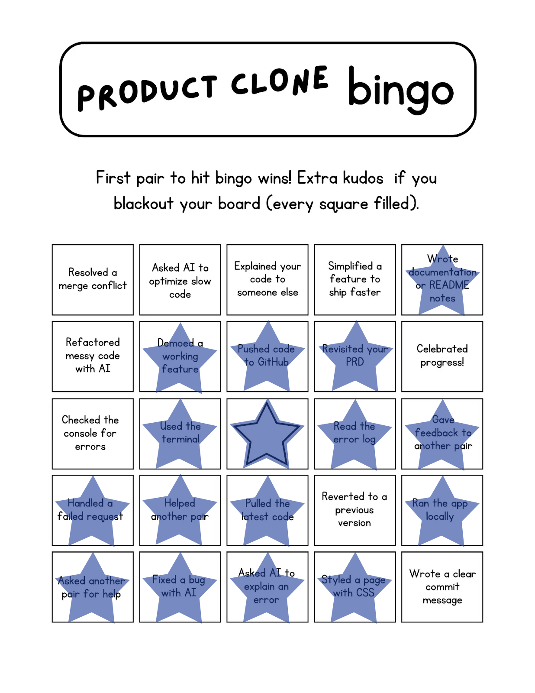

#airbnb.productclonebingo

##Progress Bingo Introduction

##Checklist done:
- Wrote documentation or README notes
- Demoed a working feature
- Pushed code to GitHub
- Revisited your PRD
- Used the terminal
- Read the error log
- Gave feecback to another pair
- Handled a failed request
- Helped another pair
- Pulled the latest code
- Ran the app locally
- Asked another pair for help
- Fixed a bug with AI
- Ask AI to explain the error
- Styled a page with CSS

##Checklist undone(need to work on it):
- Resolved a merge conflict
- Asked AI to optimize slow code
- Explained your code to someone else
- Simplified a feature to ship faster
- Refactored messy code with AI
- Celebrated progess!
- Checked the console for errors
- Reverted to a previous version
- Wrote a clear commit message

That is all for now.  I will learn the undone checklist and practice until I become fluent with it.  
